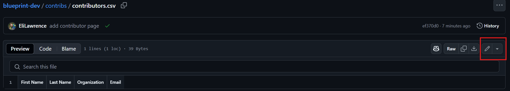
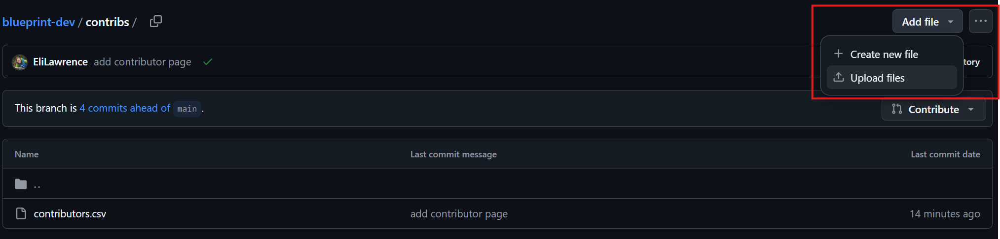

# blueprint-dev

Sandbox for developing the interactive Blueprint product

## Add contributors

To add to the list of contributors, go to the contribs folder and open the [contributors](https://github.com/BioEcoOcean/blueprint-dev/blob/zoom-patch/contribs/contributors.csv).csv file. To edit the file, you have two options:

1. Click the pencil in the top right. Then edit the file directly. Do not add spaces between commas separating names, but within a name or organization title it's okay. Example: FIRST NAME,LAST NAME,ORGANIZATION TITLE,EMAIL. Email is optional and we can remove this column if necessary. When you're done, click the green commit changes button.
   
2. Download the csv file by clicking the three ... button in the top right, make edits in your prefered csv-editing software (e.g. Excel).
   a. Reupload the file by navigating the the [contribs folder](https://github.com/BioEcoOcean/blueprint-dev/tree/zoom-patch/contribs).
   
   b. Click add file, then upload the modified file. Do not change the file name, it's okay if it is overwritten. If you need to add, remove, or change columns, please make sure there is always "First Name", "last Name", and "Organization". Contact @EliLawrence for questions.

## Host script locally

1. Navigate to the directory containing project files. For example: cd /path/to/your/project
2. Start the HTTP server: `python -m http.server 8000`
3. Navigate to http://localhost:8000 
